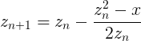

Go Programming for Java Developers
==================================

Notes for my [Go](https://golang.org) programming workshop.

1 About Me
----------

* Fabian Stäber, ConSol Software GmbH
* Java Developer, Gopher
* Some Go projects on GitHub, like [github.com/fstab/grok_exporter](https://github.com/fstab/grok_exporter)

2 Resources
-----------

* **Online tutorial:** https://tour.golang.org
* **Book:** Alan A. A. Donovan, Brian W. Kernighan: _The Go Programming Language_, Addison-Wesley, 2015
* **Google:** Google keyword for the Go programming language is 'golang'
* **This text:** [https://github.com/fstab/go-programming-for-java-developers](https://github.com/fstab/go-programming-for-java-developers)
* **Slides:** [https://goo.gl/P7XAXn](https://goo.gl/P7XAXn) (docs.google.com)

3 About Go
----------

* Created at Google in 2007 by Robert Griesemer, Rob Pike, and Ken Thompson
* Main design goal: Simplicity (not many features)
* Main purpose: System tools programming

4 Go for Java Developers
------------------------

Go is very similar to Java

* C-like Syntax
* Strongly typed
* Packages, Imports
* ...

Java developers will learn Go very quickly.

5 Installation
--------------

Java:

* Download and extract JDK.
* Set environment variable `JAVA_HOME` to JDK directory.
* Include `$JAVA_HOME/bin` in `PATH`.

Go:

* Download and extract Go.
* Set environment variable `GOROOT` to Go directory (default `/usr/local/go` or `C:\Go`).
* Include `$GOROOT/bin` in `PATH`.

Optional (not needed in this workshop): Set `GOPATH` to workspace, like `$HOME/go`.

6 Exercise
----------

* Install go
* Run the following commands

```bash
go
go help
go help run
go help fmt
```

7 Go Tool
---------

The `go` command is more like `mvn` than like `javac`.

```
go get ...               <-- download from github, bitbucket, etc.
go test ...              <-- like 'mvn test'
go install ...           <-- install binary to $GOPATH/bin
```

8 Go Directory Structure
------------------------

Like `mvn`, the `go` command assumes a defined directory structure:

```
$GOPATH/bin                     <- compiled executables
$GOPATH/pkg                     <- compiled libraries
$GOPATH/src/github.com/...      <- source code
$GOPATH/src/bitbucket.org/...   <- source code
$GOPATH/src/...                 <- source code
```

In real-world go development, you run `go install` to compile the source code and create an executable in `$GOPATH/bin`.

However, in this workshop we use `go run`, which is a shortcut to quickly run a single go file. The `go run` command does not require the directory structure above.

9 Hello, World!
---------------

```go
package main

import (
    "fmt"
)

func main() {
    fmt.Printf("Hello, World!\n")
}
```

10 Exercise
----------

* Create a file `hello.go` containing the hello world source code.
* Format and run the program:

```bash
go fmt hello.go
go run hello.go
```

Read the documentation of the `fmt` package and the `Printf` call

```bash
go doc fmt
go doc fmt.Printf
```

11 Hello, &lt;name&gt;!
-----------------------

* `os.Args` is an `[]string` (like `String[]` in Java)
* `len(os.Args)` returns the number of elements (like `arr.length` in Java)

```go
package main

import (
    "fmt"
    "os"
)

func main() {
    if len(os.Args) != 2 {
        fmt.Printf("Usage: ./hello <name>\n")
        return
    }
    fmt.Printf("Hello, %v\n", os.Args[1])
}
```

12 os.Args[0]
-------------

* `os.Args[0]` is the name of the executable
* Example: `./hello Fabian`:
  * `os.Args[0]`: `./hello`
  * `os.Args[1]`: `Fabian`
* With `go run hello.go Fabian`, the program will be compiled to an executable in a temporary directory, this temporary executable is executed. -> `os.Args[0]` is the path to the temporary executable created by `go run`.

13 Loops
--------

Use of `for` like Java's `for`

```go
for i := 0; i < 10; i++ {
    fmt.Printf("%v\n", i)
}
```

Use of `for` like Java's `while`

```go
i := 0
for i < 10 {
    fmt.Printf("%v\n", i)
    i++
}
```

Use of `for` like Java's `while(true)`

```go
i := 0
for {
    if i >= 10 {
        break
    }
    fmt.Printf("%v\n", i)
    i++
}
```

14 Exercise
-----------

Write a program that says hello to multiple people:

```console
> go run hello.go Fabian Thomas Christian
Hello, Fabian!
Hello, Thomas!
Hello, Christian!
```

15 Variables
------------

Variable declaration

```go
var a int
a = 3
```

Variable declaration with initializer

```go
var a = 3
```

Short variable declaration

```go
a := 3
```

Declaring multiple variables

```go
var (
    a, b int
    c string
)

var a, b, c = 3, 4, "hello"
```

Constants (like `final` in Java)

```go
const a = 3
```

16 Functions
------------

```go
func add(a int, b int) int {
    return a + b
}
```

```go
func add(a, b int) int {
    return a + b
}
```

```go
func addAndMult(a, b int) (int, int) {
    return a + b, a * b
}

func main() {
    sum, product := addAndMult(3, 7)
    fmt.Printf("sum = %v, product = %v\n", sum, product)
}
```


17 Function Example
-------------------

```go
package main

import "fmt"

func swap(x, y string) (string, string) {
    return y, x
}

func main() {
    a, b := swap("world", "hello")
    fmt.Printf("%v, %v\n", a, b)
}
```

18 Error Handling with Multiple Return Values
---------------------------------------------

```go
package main

import (
    "fmt"
    "strconv"
    "os"
)

func main() {
    // We assume that len(os.Args) >= 2
    n, err := strconv.Atoi(os.Args[1])
    if err != nil {
        fmt.Printf("Error: %v is not a valid number.\n", os.Args[1])
        return
    }
    fmt.Printf("Your number is %v\n", n)
}
```

Go's `nil` is like Java's `null`.

19 Ignoring Return Values
-------------------------

In go it's a _syntax error_ if a variable is declared but not used:

```go
func main() {
    sum, product := addAndMult(3, 7)
    fmt.Printf("sum = %v\n", sum)
}
```

Syntax error, because variable `product` is declared but not used.

To explicitly ignore a return value, use `_`:

```go
func main() {
    sum, _ := addAndMult(3, 7)
    fmt.Printf("sum = %v\n", sum)
}
```

20 Exercise
-----------

Write a program that prints the first _n_ Fibonacci numbers.

```console
> go run fibonacci.go 10
1 1 2 3 5 8 13 21 34 55
```

21 Bonus Exercise
-----------------

From http://tour.golang.org

> As a simple way to play with functions and loops, implement the square root function using Newton's method.
>
> In this case, Newton's method is to approximate Sqrt(x) by picking a starting point z and then repeating:
>
> 
> 
> To begin with, just repeat that calculation 10 times and see how close you get to the answer for various values (1, 2, 3, ...).
> 
> Next, change the loop condition to stop once the value has stopped changing (or only changes by a very small delta). See if that's more or fewer iterations. How close are you to the math.Sqrt?
> 
> Hint: to declare and initialize a floating point value, give it floating point syntax or use a conversion:
> 
> z := float64(1)
>
> z := 1.0

22 Deferred Methods
------------------

```go
package main

import (
    "bufio"
    "fmt"
    "os"
)

const path = "./hello.txt"

func main() {
    file, err := os.Open(path)
    if err != nil {
        fmt.Printf("failed to open file: %v\n", err)
        os.Exit(-1)
    }
    defer file.Close()
    reader := bufio.NewReader(file)
    for {
        line, err := reader.ReadString('\n')
        if err != nil {
            break
        }
        fmt.Printf("%v\n", line)
    }
}
```

23 Exercise
-----------

Modify the _hello world_ program and add some deferred method calls, like

```go
defer fmt.Printf("defer 1\n")
defer fmt.Printf("defer 2\n")
defer fmt.Printf("defer 3\n")
```

Figure out the order in which these calls are executed.

24 Pointers
-----------

```go
package main

import "fmt"

func double(i int) {
    i = i * 2
}

func main() {
    i := 2
    double(i)
    fmt.Printf("i = %v\n", i)
}
```

Result: i = 2

```go
package main

import "fmt"

func double(i *int) {
    *i = *i * 2
}

func main() {
    i := 2
    double(&i)
    fmt.Printf("i = %v\n", i)
}
```

Result: i = 4

25 Structs
----------

```go
package main

import "fmt"

type rectangle struct {
    height float64
    width  float64
}

func main() {
    square := &rectangle{
        height: 4.0,
        width: 4.0,
    }
    fmt.Printf("square has area of %v\n", square.height * square.width)
}
```

* A struct is like a final class in Java.
* Variables starting with an upper case letter are public, variables starting with a lower case letter are package private.

26 Methods
----------

```go
package main

import "fmt"

type rectangle struct {
    height float64
    width  float64
}

func (r *rectangle) area() float64 {
    return r.width * r.height
}

func main() {
    square := &rectangle{
        height: 4.0,
        width: 4.0,
    }
    fmt.Printf("square has area of %v\n", square.area())
}
```

27 Exercise
-----------

Define `struct circle` with variable `radius` that also has a method `area()`.

Hint: `go doc math.Pi`

28 String Concatenation
-----------------------

Java: Implicit conversion from float64 to String

```java
return "the area is " + s.area();
```

Go: Explicit string formatting

```go
return fmt.Sprintf("area is %v", s.area())
```

29 Interfaces
-------------

```go
type shape interface {
    area() float64
}

func areaInfo(s shape) string {
    return fmt.Sprintf("area is %v", s.area())
}

func main() {
    c := &circle{
        radius: 2.0,
    }
    r := &rectangle{
        width: 4.0,
        height: 4.0,
    }
    fmt.Printf("circle:    %v\n", areaInfo(c))
    fmt.Printf("rectangle: %v\n", areaInfo(r))
}
```

30 Pre-Defined Interfaces
-------------------------

Go has some pre-defined interfaces. The most important ones are:

```go
type Stringer interface {
    String() string
}
```

Like Java's `toString()`

```go
type error interface {
    Error() string
}
```

Remember `file, err := os.Open(path)`? The `err` is of type `error`.

31 Exercise
-----------

Implement a `String()` method for rectangle and circle.

The following code:

```go
func main() {
    c := &circle{
           radius: 2.0,
    }
    r := &rectangle{
           width: 4.0,
           height: 4.0,
    }
    fmt.Printf("Shape 1: %v\n", c)
    fmt.Printf("Shape 2: %v\n", r)
}
```

Should produce the following output:

```console
Shape 1: circle with radius 2 and area 12.566370614359172
Shape 2: rectangle with width 4, height 4, and area 16
```

32 Functional Programming
-------------------------

Example 1: Define an anonymous function and assign it to a variable

```go
package main

import "fmt"

func main() {
    f := func(n int) int {
        return 2 * n
    }
    fmt.Printf("f(21) = %v\n", f(21))
}
```

Example 2: Pass a function as parameter to another function

```go
package main

import "fmt"

func applyFunction(n int, f func(int) int) {
    fmt.Printf("f(%v) = %v\n", n, f(n))
}

func main() {
    f := func(n int) int {
        return 2 * n
    }
    applyFunction(21, f)
}
```

33 Arrays & Slices
------------------

Java Arrays:

```java
int size = 10;
int[] arr = new int[size];
```

Go Slices:

```go
size := 10
slice := make([]int, size)
```

Iterate over a slice:

```go
for i, val := range slice {
    fmt.Printf("slice[%v] = %v\n", i, val)
}
```

34 Arrays & Slices Example
--------------------------

```go
package main

import "fmt"

func createSlice(size int) []int {
    slice := make([]int, size)
    for i := 0; i < size; i++ {
        slice[i] = i + 1
    }
    return slice
}

func applyFunction(slice []int, f func(int) int) {
    for i, n := range slice {
        slice[i] = f(n)
    }
}

func main() {
    f := func(n int) int {
        return 2 * n
    }
    slice := createSlice(10)
    fmt.Printf("%v\n", slice)
    applyFunction(slice, f)
    fmt.Printf("%v\n", slice)
}
```

Result:

```console
[1 2 3 4 5 6 7 8 9 10]
[2 4 6 8 10 12 14 16 18 20]
```

35 Slicing
----------

Example 1:

```go
slice := createSlice(10)
fmt.Printf("%v\n", slice)
part := slice[3:7]
applyFunction(part, f)
fmt.Printf("%v\n", slice)
```

Result: 

```console
[1 2 3 4 5 6 7 8 9 10]
[1 2 3 8 10 12 14 8 9 10]
```

Example 2:

```go
slice := createSlice(10)
fmt.Printf("%v\n", slice)
firstHalf := slice[:len(slice)/2]
applyFunction(firstHalf, f)
fmt.Printf("%v\n", slice)
secondHalf := slice[len(slice)/2:]
applyFunction(secondHalf, f)
fmt.Printf("%v\n", slice)
```

Result:

```console
[1 2 3 4 5 6 7 8 9 10]
[2 4 6 8 10 6 7 8 9 10]
[2 4 6 8 10 12 14 16 18 20]
```

36 Exercise
-----------

Write a function `combine()` such that

```go
func main() {
    add := func(a, b int) int {
            return a + b
    }
    mult := func(a, b int) int {
            return a * b
    }
    slice := createSlice(10)
    fmt.Printf("add(1..10)=%v\n", combine(slice, add))
    fmt.Printf("mult(1..10)=%v\n", combine(slice, mult))
}
```

Prints the following output

```console
add(1..10)=55
mult(1..10)=3628800
```

Implement `combine()` two times: one time with a `for` loop, and one time recursively without `for`.

37 Multithreading
-----------------

```go
package main

import (
    "fmt"
    "time"
)

func say(s string) {
    for i := 0; i < 5; i++ {
        time.Sleep(100 * time.Millisecond)
        fmt.Printf("%v\n", s)
    }
}

func main() {
    go say("world")
    say("hello")
}
```

38 Channels
-----------

```go
package main

import (
    "time"
    "fmt"
)

func produceNumber(c chan int) {
    time.Sleep(10 * time.Second)
    c <- 3
}

func main() {
    c := make(chan int)
    go produceNumber(c)
    n := <-c
    fmt.Printf("n = %v\n", n)
}
```

39 Loop over Data Read from Channel
-----------------------------------

```go
package main

import (
    "time"
    "fmt"
)

func produceNumber(c chan int) {
    for i := 0; i < 10; i++ {
        time.Sleep(1 * time.Second)
        c <- i + 1
    }
    close(c)
}

func main() {
    c := make(chan int)
    go produceNumber(c)
    for n := range c {
        fmt.Printf("n = %v\n", n)
    }
}
```

40 Exercise
-----------

Re-write the channel examples with two go-routines:

* One producer routine producing numbers
* One consumer routine printing numbers to stdout

Terminology: A function running as a background thread is a go-routine.

41 Waiting for termination
--------------------------

```go
package main

import (
    "time"
    "fmt"
)

func produceNumbers(c chan int) {
    for i := 0; i < 10; i++ {
        time.Sleep(1 * time.Second)
        c <- 3
    }
    close(c)
}
func consumeNumbers(c chan int, done chan interface{}) {
    for n := range c {
        fmt.Printf("n = %v\n", n)
    }
    close(done)
}
func main() {
    c := make(chan int)
    done := make(chan interface{})
    go produceNumbers(c)
    go consumeNumbers(c, done)
    <-done
}
```

42 Polling on multiple channels with select
-------------------------------------------

```go
chan c int
chan done interface{}

select {
    case n <- c:
        // do something with n
    case <- done:
        // shut down
}
```

43 Exercise
-----------

Implement a deadlock (go-routine _A_ is reading from channel of go-routine _B_ and vice versa) and see what happens.

44 Buffered Channels
--------------------

* Write to channel blocks
* Channels may have capacity
* Reading from a closed channel returns `nil`
* Writing to a closed channel panics

-> Always the producer should close a channel.

45 HTTP Server
--------------

```go
package main

import (
    "fmt"
    "net/http"
    "os"
)

func handler(w http.ResponseWriter, r *http.Request) {
    fmt.Fprintf(w, "URL.Path = %q\n", r.URL.Path)
}

func main() {
    http.HandleFunc("/", handler)
    err := http.ListenAndServe("localhost:8000", nil)
    if err != nil {
        fmt.Fprintf(os.Stderr, "Failed to open Web server on localhost:8080: %v\n", err)
    }
}
```

46 Exercise
-----------

Include a unique number in each response:

* First response gets number 1
* Second response gets number 2
* _etc._

Avoid race conditions. Don't communicate through shared memory, use channels!!!

47 Mutexes
----------

From _The Go Programming Language_, Chapter 1.7:

```go
package main

import (
    "fmt"
    "log"
    "net/http"
    "sync"
)

var mu sync.Mutex
var count int

func main() {
    http.HandleFunc("/", handler)
    http.HandleFunc("/count", counter)
    log.Fatal(http.ListenAndServe("localhost:8000", nil))
}

// handler echoes the Path component of the requested URL.
func handler(w http.ResponseWriter, r *http.Request) {
    mu.Lock()
    count++
    mu.Unlock()
    fmt.Fprintf(w, "URL.Path = %q\n", r.URL.Path)
}

// counter echoes the number of calls so far.
func counter(w http.ResponseWriter, r *http.Request) {
    mu.Lock()
    fmt.Fprintf(w, "Count %d\n", count)
    mu.Unlock()
}
```

48 Summary
----------

Topics covered in this workshop:

* control flow: if/else, for
* functions, error handling, deferred methods
* pointers, structs, methods, interfaces
* arrays & slices
* multithreading

Solution to Exercise 14
-----------------------

```go
package main

import (
    "fmt"
    "os"
)

func main() {
    for i := 1; i<len(os.Args); i++ {
        fmt.Printf("Hello, %v\n", os.Args[i])
    }
}
```

Solution to Exercise 20
-----------------------

```go
package main

import (
    "fmt"
    "os"
    "strconv"
)

func main() {
    if len(os.Args) != 2 {
        fmt.Print("Usage: fibonacci <n>\n")
        return
    }
    n, err := strconv.Atoi(os.Args[1])
    if err != nil {
        fmt.Print("Invalid number.\n")
        return
    }
    fmt.Print("Result:")
    var prev, cur = 0, 1
    for i := 0; i < n; i++ {
        fmt.Printf(" %v", cur)
        prev, cur = cur, prev + cur
    }
    fmt.Print("\n")
}
```

Solution to Exercise 23
-----------------------

```go
package main

import (
    "fmt"
)

func main() {
    defer fmt.Printf("defer 1\n")
    defer fmt.Printf("defer 2\n")
    fmt.Printf("Hello, World!\n")
    defer fmt.Printf("defer 3\n")
}
```

Solution to Exercise 27
-----------------------

```go
package main

import (
    "fmt"
    "math"
)

type rectangle struct {
    height float64
    width  float64
}

func (r *rectangle) area() float64 {
    return r.width * r.height
}

type circle struct {
    radius float64
}

func (c *circle) area() float64 {
    return math.Pi * c.radius * c.radius
}

func main() {
    r := &rectangle{
        height: 4.0,
        width: 4.0,
    }
    c := &circle{
        radius: 2.0,
    }
    fmt.Printf("square has area of %v\n", r.area())
    fmt.Printf("circle has area of %v\n", c.area())
}
```

Solution to Exercise 31
-----------------------

```go
package main

import (
    "fmt"
    "math"
)

type rectangle struct {
    height float64
    width float64
}

func (r *rectangle) area() float64 {
    return r.width * r.height
}

type circle struct {
    radius float64
}

func (c *circle) area() float64 {
    return math.Pi * c.radius * c.radius
}

func (r *rectangle) String() string {
    return fmt.Sprintf("rectangle with width %v, height %v, and area %v", r.width, r.height, r.area())
}

func (c *circle) String() string {
    return fmt.Sprintf("circle with radius %v and area %v", c.radius, c.area())
}

func main() {

    c := &circle{
        radius: 2.0,
    }

    r := &rectangle{
        width: 4.0,
        height: 4.0,
    }

    fmt.Printf("Shape 1: %v\n", c)
    fmt.Printf("Shape 2: %v\n", r)
}
```

Solution to Exercise 36
-----------------------

```go
package main

import "fmt"

// for loop
func combine1(slice []int, f func(int, int) int) int {
    result := slice[0]
    for i := 1; i < len(slice); i++ {
        result = f(result, slice[i])
    }
    return result
}

// recursive
func combine2(slice []int, f func(int, int) int) int {
    if len(slice) == 1 {
        return slice[0]
    }
    if len(slice) == 2 {
        return f(slice[0], slice[1])
    }
    left := combine2(slice[:len(slice)/2], f)
    right := combine2(slice[len(slice)/2:], f)
    return f(left, right)
}

func createSlice(size int) []int {
    slice := make([]int, size)
    for i:=0; i<size; i++ {
        slice[i] = i+1
    }
    return slice
}

func main() {
    add := func(a, b int) int {
        return a + b
    }
    mult := func(a, b int) int {
        return a * b
    }
    slice := createSlice(10)
    fmt.Printf("for loop:\n")
    fmt.Printf("add(1..10)=%v\n", combine1(slice, add))
    fmt.Printf("mult(1..10)=%v\n", combine1(slice, mult))

    fmt.Printf("\nrecursive:\n")
    fmt.Printf("add(1..10)=%v\n", combine2(slice, add))
    fmt.Printf("mult(1..10)=%v\n", combine2(slice, mult))
}
```

Solution to Exercise 40
-----------------------

```go
package main

import (
    "time"
    "fmt"
)

func produceNumbers(c chan int) {
    for i := 0; i < 10; i++ {
        time.Sleep(1 * time.Second)
        c <- i
    }
    close(c)
}

func consumeNumbers(c chan int) {
    for n := range c {
        fmt.Printf("n = %v\n", n)
    }
}

func main() {
    c := make(chan int)
    go produceNumbers(c)
    go consumeNumbers(c)
    time.Sleep(12 * time.Second)
}
```

Solution to Exercise 43
-----------------------

```go
package main

func main() {
    c1, c2 := make(chan int), make(chan int)
    done := make(chan interface{})
    go func() {
        <-c1     // read from c1
        c2 <- 42 // write to c2
        close(done)
    }()
    go func() {
        <-c2     // read from c2
        c1 <- 42 // write to c1
        <-done
    }()
    <-done
}
```

Solution to Exercise 46
-----------------------

```go
package main

import (
    "fmt"
    "net/http"
    "os"
)

var c = make(chan int)

func producer() {
    i := 0
    for {
        i++
        c <- i
    }
}

func handler(w http.ResponseWriter, r *http.Request) {
    fmt.Fprintf(w, "Request number is %v. Note that you browser might send two requests per 'reload'.\n", <- c)
}

func main() {
    go producer()
    http.HandleFunc("/", handler)
    err := http.ListenAndServe("localhost:8000", nil)
    if err != nil {
        fmt.Fprintf(os.Stderr, "Failed to open Web server on localhost:8080: %v\n", err)
    }
}
```
